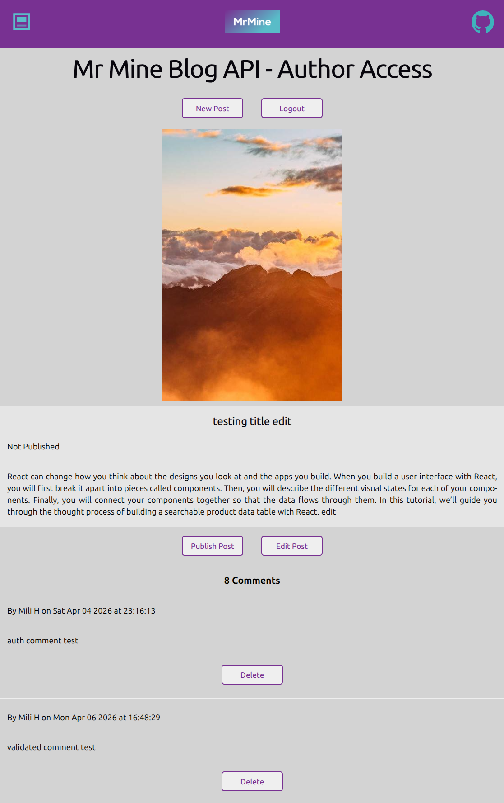

# Blog API - Backend Repo

An API only backend for a blog web app using Node, Express, PostgreSQL and Prisma ORM.

It is accessed by two completely separate and different frontend web apps and repos, one for blog consumption (readers) and one for blog editing (authors), which I developed using React.

The web app for the readers can view the posts and leave comments. To leave comments, they must sign up and login.

The web app for the authors who, after logging in, can create and edits posts with the ability to publish or unpublish posts for the readers. Authors can also delete comments made by the readers.

This project is from The Odin Project course in the Node section.

By building these 3 repos from scratch, this will help solidify my recent learning of developing REST APIs and using JSON Web Tokens for stateless authentication between the frontend and backend.

This API only backend and PostGreSQL database is hosted on Railway and both frontend's are hosted on Netlify.

The 2 frontend repos and live links are here:

https://github.com/Michael-Mine/odin-blog-api-user

Live Link: https://mrmine-blog-api-user.netlify.app/

https://github.com/Michael-Mine/odin-blog-api-author

Live Link: https://mrmine-blog-api-author.netlify.app/



## Highlights

- **Authentication**: Stateless authentication using JSON Web Tokens (JWTs) issued from the backend and held in the frontend using localstorage.

- **Relational Logic**: Users, Posts, and Comments modeled with relational schemas.

---

## Tech Stack

| Layer    | Technologies                        |
| -------- | ----------------------------------- |
| Frontend | React, JavaScript, Vite, Native CSS |
| Backend  | Node, Express, JavaScript, JWTs     |
| Database | PostgreSQL, Prisma ORM              |
| Testing  | Vitest, React Testing Library       |

---

## System Architecture

The application is split into a 3 repos for clear separation of concerns.

- **Server**: A RESTful API focused on controller functions and middleware validation.
- **Clients**: Component-based SPAs utilizing React Router for navigation and PropTypes for type checking.

---

## Database Schema

```prisma
model User {
  id        Int       @id @default(autoincrement())
  cuid      String    @default(cuid(2))
  firstName String
  lastName  String
  username  String    @unique
  password  String
  isAuthor  Boolean   @default(false)
  posts     Post[]
  comments  Comment[]
}

model Post {
  id            Int       @id @default(autoincrement())
  title         String
  content       String
  picUrl        String?
  author        User      @relation(fields: [authorId], references: [id])
  authorId      Int       @default(1)
  isPublished   Boolean   @default(false)
  datePublished DateTime?
  comments      Comment[]
}

model Comment {
  id        Int       @id @default(autoincrement())
  content   String
  date      DateTime  @default(now())
  author    User      @relation(fields: [authorId], references: [id])
  authorId  Int
  post      Post      @relation(fields: [postId], references: [id])
  postId    Int
}
```

---

## Local Development

### Prerequisites

- Node.js v18+
- PostgreSQL instance

### Setup

**1. Clone & Install:**

```bash
git clone https://github.com/Michael-Mine/odin-blog-api.git

npm install
```

**2. Environment Setup:**

Create a `.env` in root with your `DATABASE_URL` and different JWT secrets as `JWT_SECRET_USER` and `JWT_SECRET_AUTHOR`

**3. Initialize and View Database:**

```bash
npx prisma migrate dev
npx prisma generate
npx prisma studio
```

**4. Run:**

```bash
node --watch app.js
```

## Deployment on Railway

1. Link GitHub repo

2. Add a new Postgres database

3. Add the new Postgres database as `DATABASE_URL`variable in project

4. Add JWT secrets as `JWT_SECRET_USER` and `JWT_SECRET_AUTHOR` variables in project

5. Add the following settings in project:

Custom Build Command:

```bash
npx prisma generate
```

Pre-deploy Command:

```bash
npx prisma migrate deploy
```

6. Manually add a new User with `isAuthor: true` in the Railway Posgres database.

As the password stored is hashed based on your author secret, you will need to create the user in development to get the hashed password value.

This can be done via curl or postman, as the standard signup is for readers only, as based on a different user secret.

Alternatively, you can temporary change the user secret to the same as the author secret to get the hashed password value.
